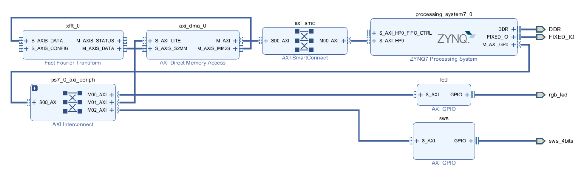

markdown
# Taksun PYNQ Example for FFT, DMA and GPIO 

## Contents
* [VIVADO Project](#vivado-project)
* [Import Library](#import-library)
* [Download Bit](#download-bit)
* [VIVADO IPs](#vivado-ips)
* [Direct GPIO](#direct-gpio)
* [Convert to GPIO](#convert-to-gpio)
* [LED Blinker](#led-blinker)
* [Read Keys](#read-keys)
* [DMA Object](#dma-object)
* [Get Memory](#get-memory)
* [Play Wave Sound](#play-wave-sound)
* [Start DMA](#start-dma)
* [Real Part of Result](#real-part-of-result)
* [abs of FFT Result](#abs-of-fft-result)
* [20 Log of FFT Result](#20-log-of-fft-result)

## VIVADO Project


[)](https://youtu.be/a1qhj8baiU4)

## Import Library
```python
from pynq import PL
from pynq import Overlay
from pynq.lib import AxiGPIO
from pynq.lib import dma
import math
import matplotlib.pyplot as plt
import time
import numpy as np
from pynq import Xlnk
from IPython.display import Audio
Xlnk = Xlnk()
```

## Download Bit
Load FFT project bitstream file on PL


```python
bit = "/home/xilinx/Overlay/fft.bit"
ol = Overlay(bit)
```


## Download Bit
Load FFT project bitstream file on PL

```python
bit = "/home/xilinx/Overlay/fft.bit"
ol = Overlay(bit)
```

## VIVADO IPs
Show IPs in block diagram as python objects

```python
ol.ip_dict.keys()
```
Output:

dict_keys(['axi_dma_0', 'led', 'sws'])
## Direct GPIO
Control RGB LED with 3 bits

```python
ol.led.write(0,1)
time.sleep(0.2)
ol.led.write(0,2)
time.sleep(0.2)
ol.led.write(0,4)
time.sleep(0.2)
ol.led.write(0,0)
time.sleep(0.2)
```
##Convert to GPIO
Convert led and sws as GPIO python objects

```python
led_IP = ol.ip_dict['led']
led = AxiGPIO(led_IP).channel1
key_ip = ol.ip_dict['sws']
key = AxiGPIO(key_ip).channel1
```
## LED Blinker
5 time blink RGB led

```python
for x in range(5):
    led.write(7,7)
    time.sleep(0.2)
    led.write(0,7)
    time.sleep(0.2)
```

## Read Keys
```python
for x in range(5):
    a = key.read()
    print('Keys = ' + str(a))
    time.sleep(0.5)
```
Output:

Keys = 12
Keys = 12
Keys = 12
Keys = 12
Keys = 12
## DMA Object
```python
dma_ip = ol.ip_dict['axi_dma_0']
dma_send = ol.axi_dma_0.sendchannel
dma_recv = ol.axi_dma_0.recvchannel
```
## Get Memory
Get Memory for Buffer with Complex int16 for DMA Transfer

```python
inputBuf = Xlnk.cma_array(shape=(2,1024),dtype=np.int32)
FFTBuf = Xlnk.cma_array(shape=(2,1024),dtype=np.int32)
```
## Play Wave Sound
```python
framerate = 22000
Audio(inputBuf[0,:],rate=framerate)
```
## Start DMA
```python
dma_recv.transfer(FFTBuf)
dma_send.transfer(inputBuf)
dma_send.wait()
```
## Real Part of Result
```python
plt.plot(FFTBuf[0,:])
plt.show()
```
## abs of FFT Result
```python
plt.plot(np.abs(FFTBuf[0,:]))
plt.show()
```
## 20 Log of FFT Result
```python
plt.plot(20*np.log10(np.abs(FFTBuf[0,:])))
plt.show()
```
